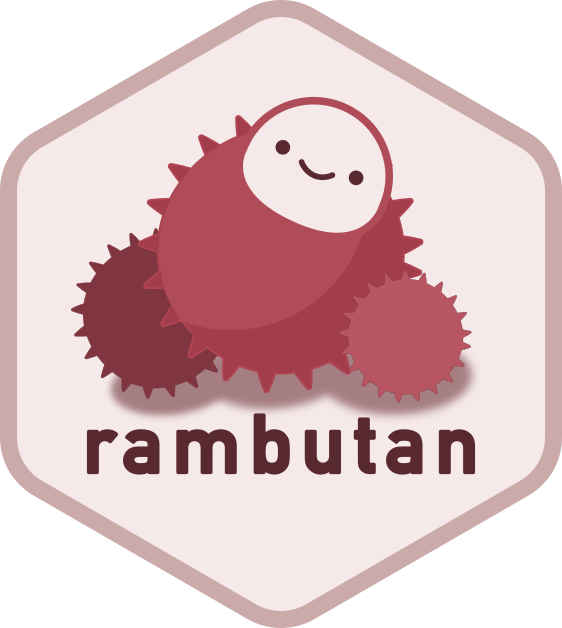

<!-- README.md is generated from README.Rmd. Please edit that file -->

# rambutan <a href="http://drmowinckels.io/rambutan/"></a>

<!-- badges: start -->

[](https://github.com/drmowinckels/rambutan/actions/workflows/R-CMD-check.yaml)
[](https://github.com/drmowinckels/rambutan/actions/workflows/test-coverage.yaml)
<!-- badges: end -->

rambutan is an R interface to
[lychee](https://github.com/lycheeverse/lychee), a fast, async link
checker written in Rust. It wraps `lychee-lib` via
[extendr](https://extendr.github.io/) to check URLs, files, and
directories for broken links, and to scan an R package’s own sources for
broken URLs the way `R CMD check --as-cran` and CRAN’s incoming checks
do.

## Installation

rambutan is not yet on CRAN. You can install the development version
from [GitHub](https://github.com/) with:

``` r
# install.packages("pak")
pak::pak("drmowinckels/rambutan")
```

Building rambutan requires Cargo and rustc (Rust’s package manager and
compiler); see [rustup.rs](https://rustup.rs/) for installation
instructions.

## Example

Check a single URL:

``` r
library(rambutan)
check_url("https://www.r-project.org")
#> $url
#> [1] "https://www.r-project.org"
#> 
#> $is_success
#> [1] TRUE
#> 
#> $code
#> [1] 200
#> 
#> $details
#> [1] "200 OK"
```

Check several URLs concurrently:

``` r
check_urls(c("https://www.r-project.org", "https://cran.r-project.org"))
#>                          url is_success code details
#> 1  https://www.r-project.org       TRUE  200  200 OK
#> 2 https://cran.r-project.org       TRUE  200  200 OK
```

Scan a file or directory for links and check every one found:

``` r
check_paths("README.md")
```

`check_file()`, `check_folder()`, and `check_project()` cover the common
cases on top of `check_paths()`: a single file, a folder (optionally
non-recursive or restricted to certain extensions), and a whole project
directory that skips dependency and build directories like
`node_modules`, `renv`, and `target`:

``` r
check_file("README.md")
check_folder("vignettes")
check_project(".")
```

Scan an R package’s own sources (`DESCRIPTION`, Rd files, `NEWS.md`,
`CITATION`, vignettes) for URLs, mirroring CRAN’s own URL check:

``` r
check_package(".")
```
